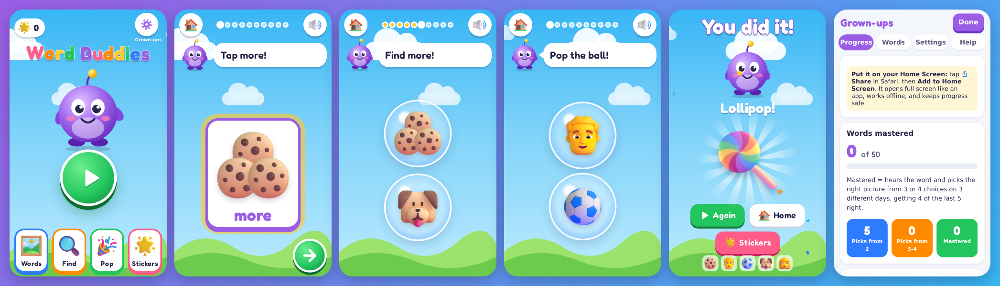

# Word Buddies

A bright, cartoon **listening game** that helps a toddler (around 30 months) with a speech delay **understand 50 important first words**. Pip the mascot says a word and the child taps the matching picture. Nothing asks the child to talk. It builds receptive language (understanding), which comes before speaking.

It's built to install on an **iPhone** like an app: full screen, its own Home Screen icon, and it works offline.



## Put it on your iPhone

The game is a web app (a "PWA"), so it doesn't need the App Store. Host it once, then add it to the Home Screen.

1. **Host it with GitHub Pages (free).** In this repository on GitHub go to **Settings → Pages**. Under *Build and deployment* choose **Deploy from a branch**, pick the branch with this code (for example `main`) and the **/(root)** folder, then **Save**. About a minute later it's live at:
   **https://captainteach123.github.io/Language-Game/**
2. **On the iPhone**, open that link in **Safari**, tap **Share** (the square with an arrow), then **Add to Home Screen → Add**.
3. Open **Word Buddies** from the Home Screen. It runs full screen, works without internet after the first visit, and keeps progress on the phone.

Tip for toddlers: turn on **Guided Access** (Settings → Accessibility → Guided Access, then triple-click the side button) to keep little fingers inside the game.

## How it teaches

Each **Play** session is about 10 short rounds (3 to 6 minutes) that mix two listening activities:

| Activity | What happens |
| --- | --- |
| **Learn** | A big picture appears and Pip names it slowly with a short model sentence ("Ball! Kick the ball! Ball!"). The card then glows and Pip says "Tap the ball!" When the child taps it, there's a celebration. |
| **Find it** | "Where's the dog?" with 2, 3 or 4 pictures. A correct tap gets cheers and the word said again. A wrong tap gets a gentle "That's the cat." and the right picture glows (a pointing hand appears after a second miss), so every round ends in success. If the child is still looking, Pip asks again. |

About a third of Find it rounds are **Pop** rounds, where the pictures float in bubbles ("Pop the dog!"). The home screen also has **Find** and **Pop** buttons for sessions of just that game, and **Words**, a talking picture book to browse all 50 words.

### Mastery, measured by first taps

Only the child's **first tap** in each round counts, so hints never inflate progress. Every word earns three stars:

- **Picks from 2 (blue):** right on the first try at least twice.
- **Picks from 3 or 4 (orange):** right on the first try at least twice with 3 or 4 pictures to choose from.
- **Mastered (green):** right with 3 or 4 pictures on **3 different days**, and **4 of the last 5** tries right (80%).

The number of pictures grows as the child gets a word right (2, then 3, then 4) and drops back to 2 if a word gets hard, so a lucky guess can't earn mastery. The game works on a small set of words at a time (5 by default). When one is mastered, the next word joins. Mastered words come back for a quick check after 1, 3, 7, 14 and 30 days, and a word that starts getting missed goes back into practice.

### Built on how toddlers learn words

- Slow, clear speech (speed adjustable), with the word said on its own and inside a short sentence.
- Many repetitions: each word is named when it appears, when it's tapped, and again after every correct answer.
- Errorless learning: hints after a miss, never a buzzer, and every round ends with the right answer.
- Pictures from different categories early on (a dog next to an apple, not a cat), so the task is about the word.
- Real-life practice ideas and baby-sign tips for each word in the grown-ups area.

### Keeping it fun

- **Pip**, a friendly purple mascot whose mouth moves while it talks, and who jumps and cheers.
- Bright 3D cartoon pictures that wiggle, hop, float and spin when tapped.
- Confetti, stars flying into the progress trail, popping bubbles, and cheerful sound effects.
- **Pick a present** after every session: tap a gift box to reveal a surprise sticker for the **sticker book** (36 to collect).

## The grown-ups area

**Press and hold the purple gear** on the home screen for about 2 seconds (a quick tap won't open it).

- **Progress:** words mastered, the three star counts, a 7-day practice chart with first-try accuracy, the words being learned now, and progress by category.
- **Share with your speech therapist:** exports a spreadsheet (CSV) of every word showing first-try accuracy, recent accuracy, days right, and which words are mastered.
- **Words:** every word with its stars and stats. Choose which words to learn now, or tap the pencil to:
  - **rename it** (for example "Mama", "Abuela", "Nana"),
  - **record your own voice** saying it (many kids listen best to a familiar voice),
  - **use a real photo** (your child's own cup, dog or grandparent), which helps words carry over to real life,
  - mark it as **"already understands this word"**,
  - see a **real-life practice idea** ("Ask 'Where's your nose?' and touch it together") and a baby-sign tip.
- **Settings:** child's name (used in cheers), words at a time, play length, sound effects, speaking speed, voice choice, backup and restore, and reset.
- **Help:** how to play together, what the stars mean, and iPhone tips.

Everything stays on the device: no accounts, no ads, no tracking.

## The 50 words

| Category | Words |
| --- | --- |
| People | Mommy, Daddy, baby |
| Social | hi, bye-bye, more, all done, help, yes, no, please, uh-oh |
| Actions | up, down, go, stop, open, eat, drink, sleep, hug |
| Animals | dog, cat, cow, duck, pig, bird, fish |
| Food | milk, water, juice, cookie, apple, banana |
| Body | eyes, nose, mouth, ears |
| Clothes | shoes, hat, socks |
| Toys | ball, book, car, bubbles, teddy |
| Home & Sky | bed, bath, sun, moon |

The list draws on common first-word research (MacArthur-Bates CDI and the Language Development Survey) and the "core words" speech-language pathologists teach first. It mixes words a child hears all day and will later use to ask for things (more, help, all done, up, open, go) with everyday people, animals, food, body parts, clothes, toys and household things. Words are introduced in a familiar-first order (see `START_ORDER` in `js/words.js`).

> Word Buddies supports, but doesn't replace, speech therapy. If you have concerns about your child's speech or language, talk with your pediatrician or a speech-language pathologist.

## For developers

Plain HTML, CSS and JavaScript with no build step and no dependencies.

```
index.html              app shell (iPhone meta tags, manifest, scripts)
css/app.css             all styles and animations
js/words.js             the 50 words, categories, stickers, introduction order
js/progress.js          mastery engine: first-tap stars, review schedule, session planner (unit tested)
js/storage.js           localStorage progress + IndexedDB for photos and recordings
js/audio.js             speech, grown-up voice recordings, sound effects
js/app.js               screens and games
sw.js                   offline cache (file list generated by tools/build-sw.js)
manifest.webmanifest    Home Screen app settings
img/words, img/stickers, img/ui, img/icons   pictures
tests/                  unit and data tests (node --test)
tools/                  offline-list builder, icon renderer, end-to-end playthrough
```

```sh
npm start        # serve at http://localhost:8080
npm test         # unit + data tests
npm run build    # refresh the offline file list after changing any app file (tests fail if you forget)
npm run e2e      # plays through every screen at iPhone sizes and saves screenshots (needs Playwright)
npm run icons    # re-render the app icons (needs Playwright)
```

If you later want it in the App Store, the same code can be wrapped with [Capacitor](https://capacitorjs.com/). That needs a Mac with Xcode and an Apple Developer account.

## Credits

- Pictures: [Microsoft Fluent Emoji](https://github.com/microsoft/fluentui-emoji), MIT License (`img/LICENSE-fluent-emoji.txt`).
- Font: [Fredoka](https://github.com/hafontia/Fredoka-One), SIL Open Font License (`fonts/OFL.txt`).
- Pip the mascot, app icons and sound effects are drawn and synthesized in code.
